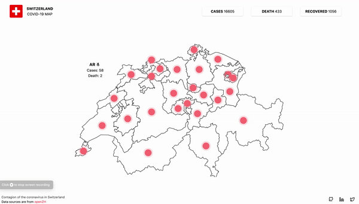

This project was bootstrapped with [Create React App](https://github.com/facebook/create-react-app).

## Available Scripts

In the project directory, you can run:

### `yarn start`

Runs the app in the development mode. 
Open [http://localhost:3000](http://localhost:3000) to view it in the browser.
Open [http://localhost:3001](http://localhost:3001) to view it in the server.

## Data
All the data are sourced from https://github.com/openZH/covid_19 and application server is based on a clone of https://covid19-rest.herokuapp.com/
